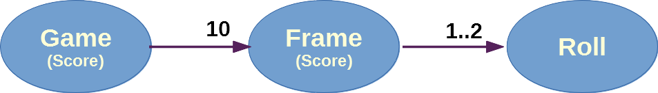

# Bowling Kata: initial design

This document amounts to a straight copy of the initial design content from [Uncle Bob's original bowling game kata](http://www.butunclebob.com/ArticleS.UncleBob.TheBowlingGameKata), restructured slightly and with a few notes added at the end.

## Scoring Bowling

A bowling game consists of 10 frames as shown above. The main figure in each box shows the accumulated score, while the two figures above show the score for each roll.

In each frame the player has two opportunities to knock down 10 pins.  The score for the frame is the total number of pins knocked down, plus bonuses for strikes and spares.

A *spare* is when the player knocks down all 10 pins in two tries. This is indicated by a half-filled square instead of a figure for the second roll of a frame. The bonus for a spare frame is the number of pins knocked down by the next roll. 

So in frame 3 above, the score is 10 (the total number knocked down) plus a bonus of 5 (the number of pins knocked down on the next roll).

A *strike* is when the player knocks down all 10 pins on their first try. The bonus for that frame is the value of the next two balls rolled.

In the tenth frame a player who rolls a spare or strike is allowed to roll the extra balls to complete.

## A quick design session

Clearly we need some kind of Game class:

A Game has ten Frames (they might be a specific class or a data structure of some sort):

A Frame normally has one or two Rolls:

However, the tenth frame has two or three rolls. It is different from all the other frames:

The score function must iterate through all the Frames, and calculate all their scores:

The score for a spare or a strike depends on the frame's successor

## Design Summary

Write a class named **Game** that has two methods:

1. *Roll(int pins)* is called each time the player rolls a ball.  The argument is the number of pins knocked down.
2. *int Score()* is called only at the very end of the game.  It returns the total score for that game.

## Notes

I've redesigned the diagrams just a little as I've always found Uncle Bob's versions to look a little bit too much like UML. I found this confusing when I first started using the Kata, as it set expectations about creating a Frame class, a Roll class etc... 

(**Spoiler alert:** that's not how the Kata actually pans out...)

## Structure of the C# / VS port

My port of the Bowling Game Kata is broken down into the following sections, which largely follow the original:

* [Introduction](README.md) 
* [Initial Design](INITIAL_DESIGN.md) <-- You are here 
* [Commit 1](COMMIT_1.md) 
* [Commit 2](COMMIT_2.md) 
* [Commit 3](COMMIT_3.md) 
* [Commit 4](COMMIT_4.md) 
* [Commit 5](COMMIT_5.md) 

There's also a Visual Studio Commits branch, with the [five commits posted to it](https://github.com/TrovoLtd/BowlingGameKata/commits/TheCommits/src/BowlingKata), so you can see the state the code should be in at the end of each part of the Kata.