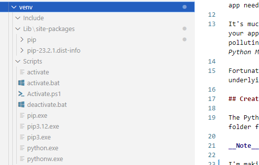
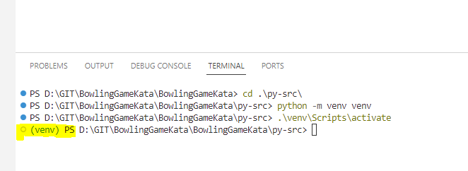

# Setting up a Python Virtual Environment

When coding in Python, it's good practice to keep the core Python Interpreter as isolated as possible from _any_ dependencies (i.e. third-party libraries) that each Python application you are working with depends upon.

Let's unpack this statement a little:

- The fundamental software used whenever you run a piece of Python code is called the __Interpreter__, and you can (and usually should) have multiple Interpreter versions on your development machine at any given time. 
- New versions of The Interpreter are released regularly. There's one official Feature Release per year, but there might also be ad-hoc ones if vulnerabilities are found. You should always migrate applications away from Interpreters that are no longer supported, and you might need to update any applications you have to a newer version of the Interpreter at any point in time.
- Different applications are likely to depend upon different libraries. If these libraries are installed directly as Modules for whichever Interpreter you are using when you're creating the application, then they won't be available to that application when you switch to a newer interpreter. 
- Also, each Interpreter version can only work with one version of a library at a time, so if your Application A depends on V1, but Application B needs V2, you won't be able to use the same Interpreter for both apps if you've installed the library at the Interpreter level. 
- Similarly, if you install _all_ the dependencies for _all_ the applications you produce in one central location, it soon becomes very hard to keep track of which app needs which library, and each Interpreter version you are maintaining ends up with a massive list of Modules to manage.

It's much more efficient to let an application's dependencies live _with the application_, and not with the Interpreter that the application was built with. Keep your applications and their dependencies isolated from your Interpreters, and keep each Interpreter nice and clean. Of course, there's nothing stopping you from polluting your Interpreter right away, though, as the Python ecosystem makes it very easy to do so. Therefore, _resist the temptation to just start installing Python Modules in a big hurry to get stuff working_. Take a deep breath and plan what you're going to do a little, instead.

Fortunately there is a suite of tools to help manage dependencies at the application level, and also to keep the separation between your applications and the underlying set of Interpreters. The core tool for maintaining that separation is called a __Virtual Environment__.

## Creating a Virtual Environment

The Python Interpreter ships with all the scripts required to create Virtual Environments. All you need to do is decide which folder you want to make your working folder for the Virtual Environment, and then execute the Virtual Environment creation script in that folder.

__Note__: I'm working on Windows (what can I say, I was a C# guy for years) - so the instructions below are for that OS. 

I'm making the _py-src_ directory in this repo the working directory for all the Python code, so that's where I'm going to create my Virtual Environment. That said, you won't be any the wiser that I have done, because I've added some instructions to my [.gitignore](../.gitignore) file to prevent me from committing the files that are created when I do so. (Incidentally - this is where I got [a standard list of Python files to ignore](https://github.com/github/gitignore/blob/main/Python.gitignore) from).

So you're just going to have to trust that I opened a Terminal window in this directory and entered the following command:

```
python -m venv venv
```

... though by way of proof, here's a screenshot of the File Explorer in my VS Code, showing the files that were created when I ran that command:



A key file you'll see in that shot is a script called _activate_, which is what we then need to run to start the Virtual Environment. Run:

```
.\venv\Scripts\activate
```

... and that, er, activates the Virtual Environment. You'll know it's worked when you see the name of the Virtual Environment added in brackets before the command prompt in the Terminal, like this:



So now, when any dependencies are installed using that Virtual Environment, they'll be installed in the .venv folder local to the application code, and will be nicely isolated from our underlying Python Interpreter. We'll then be able to do things like updating the underlying Interpreter, and managing all the dependencies for each application locally.

The fundamentals about Virtual Environments are in [the formal Python documentation about venv](https://docs.python.org/3/library/venv.html).

### Why call our environment "venv"?

Strictly speaking we could have run this command to setup the Virtual Environment:

```
python -m venv WeCouldGiveOurVirtualEnvironmentAnyNameWeWantHere
```

... but like a lot of Pythony things (Numpy is conventionally imported as "np", Pandas as "pd" etc), _venv_ seems to have just become "the name everyone uses", so you'll find a lot of documentation and process examples use this name. Why fight it?

## So what's going on here?

Virtual Environments work by creating links between a dummy Python Interpreter in the venv's _Scripts_ directory and the underlying Interpreter that was on the system path at the time the venv was created. Now we have a Virtual Environment that is nicely isolated from the underlying Python, our application code is a lot easier to keep up-to-date. One way we could do this would be by updating the Virtual Environment itself using a command like:

```
python -m venv --upgrade <<PATH_TO_THE_NEW_INTERPRETER_VERSION>>
```

This would then update the link in the Scripts directory to point to the new Interpreter. (Of course, this could break your application and / or any of the dependencies it uses, which is where the Unit Testing we're working towards comes in handy).

Another approach, however, is to make our Python application into a fully-managed _Project_, with managed dependencies. In this way of working, if we want to move to a new Virtual Environment that points to an updated Python Interpreter version, we could pull the application Project from source and rebuild it in a brand new Virtual Environment that's based on the new Python version. Again, stuff could break at this point, but if we've got a good set of tests, we'll know.

The former technique takes a bit less effort (and less network bandwidth), and is fine if we're working on our own. But if we work towards the latter option, we'll be in a place where our code is more portable, easier to share around and to collaborate with. So that's the approach we'll investigate here. 

